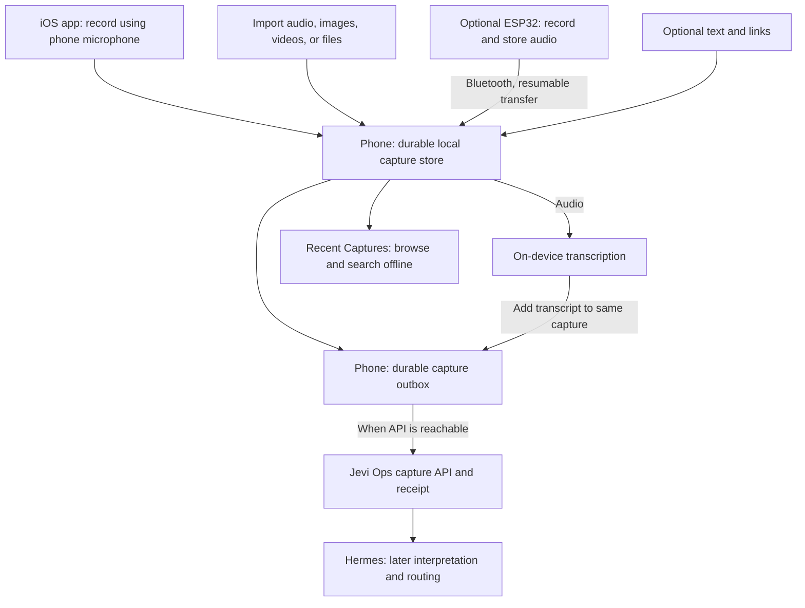

# Offline capture on the phone

**Status:** Product scope prepared for implementation; native capture is not implemented. **Updated:** 17 September 2026.
**Implementation baseline:** `main` at `438db18` (PRs #51 and #52 merged).
**Delivery breakdown and readiness:** [Implementation plan](03-native-ios-implementation-plan.md).

## Scope boundary · clarified 17 September 2026

This is the **offline capture and native iOS** plan: durable local storage, phone recording, local transcription, mixed attachments, offline retrieval, eventual delivery, and optional ESP32 import. PR #51 supplies the server capture foundation; its merge close-out is separate from implementing this proposal. Gate C supplies later asynchronous interpretation and routing.

The [configurable lists and purchase tracking plan](../configurable-list-workflows-plan.md) independently owns custom statuses, presets, Shopping, and kit maintenance integration. Those features are not prerequisites for native capture. A captured note may later create or link to a task through ordinary server operations; that does not merge the two product scopes or require offline replication of Shopping and checklist workflows.

Use separate implementation branches, PRs, and acceptance criteria. Reuse shared command-retry and transaction infrastructure without introducing a dependency on the other effort's UI or release schedule.

## Product outcome

The phone is the collection point for text, links, images, videos, files, its own audio recordings, imported recordings, and recordings transferred from a paired ESP32 device. A capture can combine these inputs or contain an attachment or link alone, with no accompanying text. It saves content locally, transcribes audio locally, and holds the capture ready for delivery to Jevi Ops. Recording, import of locally available content, Bluetooth transfer, and transcription must work without internet or home infrastructure after the transcription assets have been installed.

**Recording directly in the native iOS app is a first-release requirement.** The complete record → save → transcribe → queue → deliver flow must work on the phone independently, including with Bluetooth disabled and no external recorder paired. ESP32 support adds another input to that same flow.

**The phone also provides a searchable local capture library after delivery.** Uploading an item does not remove it from Recent Captures or make reading, searching, and playing retained content depend on the home server.

An ESP32 records to its own persistent storage while disconnected. When Bluetooth becomes available, it transfers recordings to the phone without requiring Wi-Fi or internet. Internet access is needed only for eventual delivery to Jevi Ops, and the queue remains intact if the home endpoint is still unavailable.

The existing Hermes capture plugin and the phone should use the same capture contract. The plugin is currently a desktop submission client, not an incoming gateway. Sending the phone's queue through an active Hermes session would add an unnecessary availability dependency and could regenerate operation identities. The recommended route is direct submission to the capture API, followed by the planned asynchronous Hermes consumer.

This advances a focused part of the existing **Gate D offline slice**. It does not require completion of Gate C interpretation to prove local capture or server storage, and should not expand PR #51's Gate B acceptance claim retrospectively.

## Record directly in iOS

The native capture screen provides a record button, a visible recording indicator, and a stop control. Recording writes audio locally as it is captured; stopping finalizes the saved recording and schedules on-device transcription. The user can leave the capture screen while the saved item awaits processing or delivery.

Phone recordings, audio imports, and ESP32 recordings use the same local store, transcription worker, transcript review, playback, and delivery queue. Preserve their source information without creating separate processing paths. The capture screen remains accessible when the web shell cannot load. Microphone permission enables phone recording; Bluetooth setup is needed only for external recorder imports.

## Text, attachments, and links

The native capture composer and iOS share entry accept optional text, links, and one or more attachments. Photos, videos, audio, documents, and other files join the same queue. Examples include a photo alone, a PDF with a dictated note, a video with a link, and a link alone. Require at least one content part; never require placeholder text or a successful transcription to save a capture.

Keep text, transcripts, links, and attachment metadata together under one capture identity. Preserve the original files and their names, types, sizes, and hashes. Copy imported file bytes into persistent app storage before reporting them saved locally. If a cloud-backed file is unavailable offline, retain the reference and show that the file still needs downloading; a reference is not a saved copy. A link itself can be saved offline, while fetching the linked page and its preview waits for connectivity.

Transcription adds derived text to the capture. OCR, video analysis, document extraction, and link enrichment can happen later without blocking storage. Files that have no interpretation support can still be retained and delivered within published storage limits. The interface must distinguish saved content from successfully interpreted content.

Uploads preserve the association between the note and every selected attachment. Track progress for each file, resume interrupted large uploads, and mark the entire capture delivered only when every selected part is acknowledged. A partially uploaded capture remains visibly incomplete and is withheld from automatic interpretation until finalized. Explicit file-size, attachment-count, and local-storage limits must be set and shown before release; “other files” does not promise unlimited size or automatic understanding of every format.

## Find and use captures after saving

### First-release local library

Recent Captures includes pending and delivered items under their existing capture identities. Index locally available notes, transcripts, filenames, and URLs for offline search. Start with a chronological list and simple type/delivery filters. Display available thumbnails, text excerpts, and filenames; missing previews must not delay saving or browsing. Retained recordings and files open locally even when Jevi Ops is unavailable.

Retain capture text, metadata, and the search index after upload. Show attachment storage use and allow explicit removal of a delivered local copy separately from deleting the capture. Indicate when a file needs downloading again. Never silently discard unsent content, and never call transcript-only delivery a backup of the original recording. This library covers captures stored on this phone; it does not require replication of every Jevi Ops record.

### Preserve the source and allow reference material

Saving requires no project, tags, or decision about what the material will become. A capture can be kept for reference without creating a task. Keep delivery state separate from review and organization: delivered can still be unreviewed; reference material does not count as unfinished work.

Hermes may later propose or apply routing under the agreed Gate C rules. Every task or other record it creates from a capture must retain a link to that capture, and the capture must record its resulting destinations. Preserve original content alongside derived transcripts and annotations until explicitly deleted. When connected, refresh those source links into the local library; displaying a link offline does not imply its entire destination record is cached.

The consumer must respect an explicit “Keep for reference” choice without generating tasks. This choice needs a supported server contract before automatic processing ships: the existing `capture_only` intent describes submission intent and must not be assumed to implement this reference disposition. Source linkage and reference handling belong in Gate C integration; the native library can work before that consumer is available.

### Fast capture with easy correction

The Share Sheet and native Record button are primary entry points. Confirm local persistence promptly, then let processing and delivery continue. Provide Undo for a newly saved item before submission starts, plus batch archive/delete in the library. Archive changes visibility, not delivery, and does not silently cancel pending uploads.

If submission has started, reconcile its receipt before claiming an undo or deletion has reached the server. Post-submission changes require explicit, retry-safe lifecycle operations; a local disappearance alone is not a server deletion. Deleting a capture does not implicitly delete a task created from it. Make local file removal, capture deletion, and removal of derived work distinct actions. Preserve the existing rule against rewriting an envelope already submitted.

### Later enhancements

- On-device OCR, suggested tags, and richer previews can enrich saved material in the background. Keep original text separate from suggestions and derived content; enrichment failure must not block capture or search of existing fields.
- Saved searches can provide collections such as Receipts, Voice Notes, or Travel References over the same records, without copying them into new lists. A visual grid and reader mode can follow the initial list view.
- Show link availability accurately: “Link saved”, “Preview available”, and “Full content available offline” describe different facts. Full-page archiving is a separate later feature; a URL or thumbnail does not establish that the page is stored.

These refinements draw on DoubleMemory's [capture and offline retrieval design](https://doublememory.com/) and [published search, collection, and capture-control features](https://apps.apple.com/us/app/bookmark-app-doublememory/id6737529034). They are requirements for this proposal, not claims that Jevi Ops already implements them. OCR, AI tags, saved searches, reader mode, and full-page archiving are outside the first phone release.

## What exists and what changes

| Existing implementation | Required extension |
| --- | --- |
| `workers/hermes-capture/jevi_capture.py` writes a pending text envelope before submitting, reconciles receipts, and replays identical requests. | Native iOS client of that protocol, with its own durable local store; no Python plugin embedded in the phone. |
| `apps/ios` is a web shell with native task creation. `Shared/PendingQueue.swift` stores task payloads and drops HTTP 4xx failures. | Native capture screen and queue that remain available when the web app cannot load. Retain rejected captures for correction; preserve the intent of existing queued tasks. |
| `packages/shared/src/schemas/durable-capture.ts` has text/audio/image kinds, a limited audio/image MIME allowlist, no attachments on text-kind captures, and spoken modality only with audio kind. Audio/image captures may already carry optional text. | A compatible contract extension for optional text plus links and mixed attachments, attachment-only captures, general files/video, and locally transcribed speech with origin preserved. Update shared fixtures, storage, readers, and processing together. |
| Current uploads allow at most four attachments of 25 MiB each and advertise no resumable transfer. | Define appropriate published limits for the broader capture scope and implement resumable large-file delivery before claiming general video support. |
| Capture receipts and `operation_receipts` already protect repeated capture operations. | Reuse these mechanisms. Do not introduce another server-side receipt ledger. |

## Reliability rules

### Save first, then transcribe

Persist incoming audio and its capture identity before starting transcription or acknowledging successful import. A failed, cancelled, or interrupted transcription leaves a saved recording that can be retried. A missing model must not prevent recording. Store audio in persistent app storage, not an evictable cache.

Use an App Group database and media directory so native entry points can share the store. Coordinate writes across the app and extensions; recover incomplete transfers and abandoned transcription work on launch. Commit verified media and its database reference before reporting that the phone has it. Do not reuse the current unlocked JSON read/modify/write queue as the durability layer.

Provide local capture even when server pairing or credentials need attention. Provisioning enables delivery; it must not be required to save a new note on the phone.

### Two separate acknowledgements

1. **Recorder → phone:** acknowledge only after the complete recording is verified and durably stored. A Bluetooth packet acknowledgement alone is insufficient. An interrupted transfer remains on the recorder. A repeated transfer resolves to the same local capture.
2. **Phone → Jevi Ops:** report delivery only after validating and saving the server's capture receipt. A timeout means the result is unknown; reconcile or retry the same operation without discarding it.

Phone receipt makes a recorder file eligible for cleanup under an explicit retention policy; it does not claim server delivery. Initially retain original audio on the phone for playback, correction, and retry, with manual removal after successful delivery of the selected content. Display storage use and refuse new imports cleanly when full. Do not silently overwrite pending recordings or attachments.

When a voice capture is submitted as a transcript alone, the server receipt means **the transcript is saved**; it does not imply the source audio is backed up. The user can include original audio as an attachment, in which case capture completion also requires that audio's receipt. Every explicitly selected file is part of delivery. Large attachments may delay their own capture, while unrelated captures continue syncing.

### Stable identity and honest progress

Deduplicate recorder imports by a stable device identity plus recording identity, bound to the paired device. Retain audio hash, original recording time, phone import time, and clock uncertainty when the recorder lacks a trustworthy clock. Do not label import time as recording time.

Keep a mutable local draft while transcription or editing is in progress. Persist a fixed submission envelope, including its attachment manifest, before its first network attempt. After that attempt, retries preserve its operation ID and every payload field, including timestamps. Further edits, attachment additions, and newly produced transcripts must wait for reconciliation and use an explicit correction path; never resend changed content under the original operation ID. If a recording is delivered before transcription finishes, its later transcript must be added to that same capture through a supported update operation.

Show storage, transcription, and delivery separately: for example, “Saved on phone · Transcribing” or “Saved on phone · Ready to send”. “Transcript saved to Jevi Ops” requires a receipt; “Capture saved to Jevi Ops” requires all selected content to be saved. A permanently rejected request needs attention and remains recoverable. One failed recording or attachment must not block unrelated captures.

## Bluetooth transfer

Use a paired BLE connection with the phone as central and recorder as peripheral. An application service exposes a recording manifest and chunked reads with offsets, stable IDs, lengths, format metadata, and a final checksum. The phone resumes from persisted progress after disconnection. The recorder keeps unacknowledged files across reboot. Espressif provides the underlying [BLE GATT server APIs](https://docs.espressif.com/projects/esp-idf/en/latest/esp32s3/api-reference/bluetooth/bt_le.html); the recording-transfer protocol still needs implementation.

This is transfer of stored files, not a requirement for a live Bluetooth microphone stream. Confirm the exact board's BLE support, persistent storage, microphone, codec, and measured throughput before fixing recording limits. Start with one recorder paired to one phone.

On iOS, background BLE needs explicit support and state restoration. It cannot guarantee immediate import in every app state; user force-quit generally prevents automatic relaunch. Foreground import must work reliably, while background import is opportunistic and resumable. Keep transcription restartable when execution time is unavailable. See Apple's [background processing guide](https://developer.apple.com/library/archive/documentation/NetworkingInternetWeb/Conceptual/CoreBluetooth_concepts/CoreBluetoothBackgroundProcessingForIOSApps/PerformingTasksWhileYourAppIsInTheBackground.html) and [relaunch rules](https://developer.apple.com/documentation/technotes/tn3115-bluetooth-state-restoration-app-relaunch-rules).

## On-device speech recognition

Benchmark two candidates on the actual phone and representative recordings, then choose one implementation for the first release:

- **Apple SpeechAnalyzer / SpeechTranscriber:** on-device recognition on supported iOS 26 devices and languages. Apple manages the model assets, which must be downloaded before offline use. A candidate for reducing application-managed model work. [Apple's implementation overview](https://developer.apple.com/videos/play/wwdc2025/277/)
- **WhisperKit with an explicitly selected small Whisper model:** a candidate when app-managed model files or different compatibility are needed. Provision the model and all required tokenizer assets ahead of time; do not rely on first-use automatic downloads. Select the model from measured accuracy, latency, memory, storage, and battery cost. [WhisperKit's source and documentation](https://github.com/argmaxinc/argmax-oss-swift)

The app currently targets iOS 17, so adopting an iOS 26-only engine requires an explicit support decision. Hardware and language support remain to be confirmed. “Offline ready” should mean an actual local transcription succeeds with network access disabled. If model assets become unavailable, continue saving audio and clearly show that transcription is pending. Do not silently fall back to a hosted speech service.

The phone produces a transcript, not semantic task execution. Keep the recording available and allow corrections; failed or empty transcription needs attention. Hermes can interpret the delivered text later. Long transcripts must respect the existing 20,000-character limit: retain and surface an over-limit result until an explicit longer-content contract exists, never truncate silently.

## Delivery scope and sequence

1. **Native offline capture and library:** record directly with the phone microphone; compose or share text, links, images, video, audio, and files with text optional; save available content locally. Provide native capture independent of the web shell, a queue, and Recent Captures with offline search, simple previews, and explicit retention/archive/delete behavior. Extend the shared contract and media delivery for this scope, then submit using capture-only credentials and existing receipt semantics. Preserve existing pending task records and recover after app termination.
2. **Local transcription:** install and verify one selected engine, process saved recordings, enable transcript review, and extend the capture contract to preserve spoken origin without requiring an audio upload. Text captures continue syncing while audio awaits processing.
3. **ESP32 import:** persistent recorder spool, pairing, resumable BLE transfer, checksums, deduplication, phone acknowledgement, and shared transcription/queue handling. Prove foreground transfer before promising background convenience.
4. **Background refinement:** test supported locked/background states, recovery, throughput, and battery use on real hardware. Server-side interpretation remains the separate Gate C consumer.

Steps 1 and 2 together form the first phone release, including attachment-only and mixed-content capture plus retrieval after delivery. Prove the complete phone-only capture and retrieval flow before adding ESP32 import in step 3. Coordinate reference disposition and links to derived records with Gate C, without making local search depend on that consumer.

A cloud relay is not required for this outcome. Add one only if the requirement becomes “upload off the phone while the home server is down”; a relay would need its own durable receipt and forwarding semantics. Likewise, multi-phone recorder ownership and full offline replication of Jevi Ops are outside this focused slice.

## Acceptance proof

- With home services stopped, internet and Bluetooth disabled, and no external recorder paired, cold-launch the iOS app, record a note using its microphone, transcribe it locally, read it, and restart the app without losing it. Restore API connectivity and verify delivery from the same queue.
- Offline, save a locally available photo, video, and document with no text; a link alone; and a capture combining text, a link, and several attachments. Restart, reconnect, and verify original content and associations survive. An unavailable cloud-backed file must remain visibly pending acquisition.
- Interrupt a large attachment upload and resume it. Verify the capture remains incomplete until all selected files are stored, interpretation waits for finalization, and unrelated text captures continue syncing.
- With internet disabled but Bluetooth enabled, import a recorder backlog and transcribe it on the phone.
- Interrupt transfer, transcription, and submission separately; resume without lost recordings or duplicate captures. Repeat a device acknowledgement after its response is lost.
- Let the server commit a capture but lose its response; the phone reconciles the same operation and displays one delivered capture.
- Restore internet while Jevi Ops remains down; content stays queued. Restore the API while Hermes remains down; text is saved and awaits interpretation.
- After successful delivery, stop home services and disable the phone's network. Search notes, transcripts, filenames, and URLs; open retained files and play a retained recording. Explicitly remove a delivered local file and verify its metadata remains searchable with an honest download-needed indicator.
- Save through the Share Sheet without choosing a project or tags. Undo before submission, batch archive, and batch delete; verify archive does not cancel delivery and an in-flight deletion does not falsely claim server completion or delete derived tasks.
- During Gate C integration, keep a capture for reference and verify no task is generated. Create a task from another capture, verify the original remains accessible and source links exist in both directions, then verify cached links remain visible offline. Confirm that a saved link or preview is never labelled a full offline page without stored page content.
- Exercise missing model assets, full storage, expired credentials, invalid payloads, inaccurate recorder clocks, and over-limit transcripts. Preserve recoverable content and show the specific blocked stage.
- Test ordinary backgrounding and user force-quit separately on physical devices. Report the actual supported behaviour instead of implying continuous background execution.

These are proposed acceptance tests, not results. No firmware, transcription model, or native capture implementation has been validated by this document.
